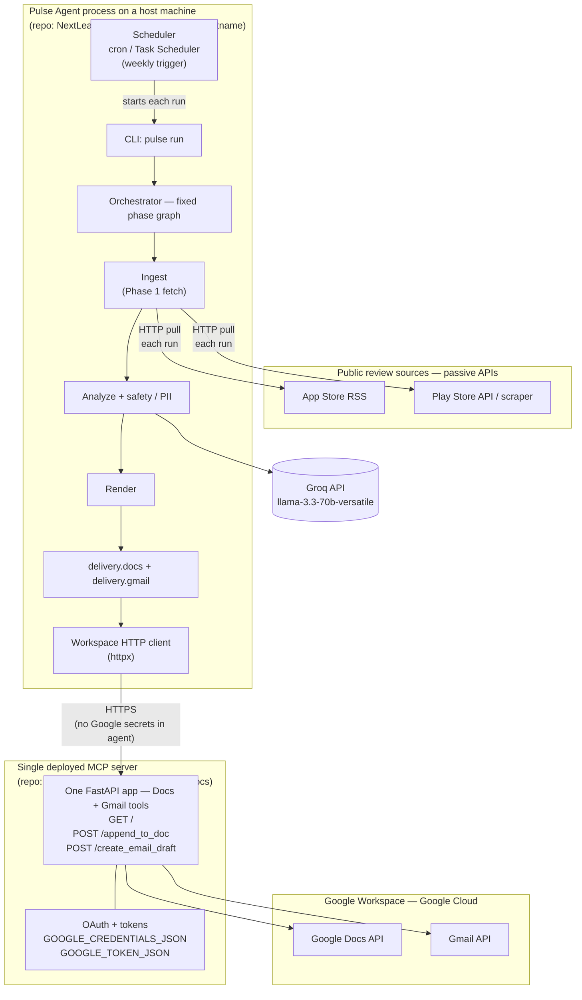

# Architecture — Weekly Product Review Pulse (Single MCP Agent)

This document describes how we implement **one** automated agent—the **Pulse Agent**—that runs the full weekly pipeline and talks to Google Workspace **only** through MCP servers. See [ProblemStatement.md](./ProblemStatement.md) for business context.

---

## 1. Design principles

| Principle | Implication |
|-----------|-------------|
| **Single agent** | One process, one run loop, one configuration surface. No separate “ingestion agent,” “writer agent,” or “mailer agent.” |
| **MCP for Google** | Docs append and Gmail send/draft are HTTP calls from the Pulse Agent process to the deployed Workspace MCP server. No Google REST SDK in the agent repo. |
| **Modular monolith** | Internal Python (or chosen runtime) packages by concern; shared types and run context across phases. |
| **Deterministic where possible** | Ingestion, clustering, idempotency keys, and render templates are code-first; LLM is used for theme naming, synthesis, and action ideas with guardrails. |
| **Idempotent weekly runs** | Keyed by `(product_id, iso_week)`; safe to retry and backfill. |
| **Auditable** | Every run emits a structured run record (inputs, MCP tool results, errors). |

---

## 2. System context

The **Pulse Agent** is the application you run (`pulse run …`). It executes on a normal **host machine** (laptop, VM, or CI runner)—there is **no** special DNS hostname called “Pulse.” The source code for that application lives in the GitHub repo **[NextLeap_AIAgent_MCP](https://github.com/pbandyop/NextLeap_AIAgent_MCP)** (Python package `pulse_agent`). The agent does **not** embed Google OAuth or the Docs/Gmail SDKs; for delivery (Phases 4–5) it calls **one** deployed HTTP service over HTTPS.

| Term | Meaning | Not this |
|------|---------|----------|
| **Pulse Agent** | The weekly-pulse app/process (`pulse` CLI) | A cloud product named “Pulse” |
| **Host** | Where the process runs (your PC, server, GitHub Actions) | A hostname or URL |
| **NextLeap_AIAgent_MCP** | GitHub **repo** for the agent codebase | The MCP server; not a hostname |

> **One MCP server in production.** “Workspace MCP server” is the role name in this architecture. [NextLeap_MCP_Server_Gmail_GDocs](https://github.com/pbandyop/NextLeap_MCP_Server_Gmail_GDocs) is the **same** service—the GitHub repo and FastAPI app you deploy (e.g. to Railway). It is not a second server. Docs append and Gmail draft are **tools/endpoints on that single deploy**, not separate MCP processes.

**How ingestion fits the schedule.** App Store and Play Store do **not** push reviews into the agent. On each run (cron e.g. Monday 09:00 IST, or manual `pulse run`), the **scheduler starts the Pulse Agent**, the orchestrator reaches **Ingest**, and Ingest **pulls** reviews over HTTP/RSS from those public APIs. Arrows in the diagram labeled “pull each run” mean *initiated by Ingest when a run starts*, not a continuous feed from the stores.



ASCII equivalent (same boundaries):

```text
  Scheduler (cron) ──starts run──► pulse run → orchestrator
                                        │
                                        ▼
  ┌─────────────────────────────────────────────────────────────┐
  │  Pulse Agent (repo: NextLeap_AIAgent_MCP) on your host       │
  │    ingest ──HTTP pull each run──► App Store RSS              │
  │           └──HTTP pull each run──► Play Store                │
  │    analyze ──► Groq API                                        │
  │    render → delivery → HTTP MCP client (Phases 4–5)          │
  └──────────────────────────────┬──────────────────────────────┘
                                 │ HTTPS (no Google secrets in agent)
                                 ▼
  ┌─────────────────────────────────────────────────────────────┐
  │  ONE deployed MCP server (NextLeap_MCP_Server_Gmail_GDocs)   │
  │  OAuth/tokens; append_to_doc; create_email_draft             │
  └──────────────────────┬──────────────────┬───────────────────┘
                         ▼                  ▼
                  Google Docs API      Gmail API  →  Google Workspace
```

| Component | What it is | Where it runs | Google OAuth here? |
|-----------|------------|---------------|-------------------|
| Pulse Agent (`pulse_agent`) | App from repo **NextLeap_AIAgent_MCP** | Your laptop, VM, or CI (any **host machine**) | **No** |
| Workspace MCP server | App from repo **NextLeap_MCP_Server_Gmail_GDocs** | Hosted URL (`GOOGLE_MCP_BASE_URL`, e.g. [Railway](https://saksham-mcp-server-production-b243.up.railway.app/)) | **Yes** (server env only) |
| Groq | LLM API (external SaaS) | Groq cloud | N/A |

**External dependencies**

- **LLM — Groq** (OpenAI-compatible chat API) for Phase 2: theme labels, summaries, actions. Key in agent env (`GROQ_API_KEY`). Called **directly** from the Pulse Agent host, not via MCP.
- **Embeddings** — local `sentence-transformers` (or sklearn fallback) in the agent; not Groq, not MCP.
- **Workspace MCP server** — the only production Google integration: one HTTP deploy of [NextLeap_MCP_Server_Gmail_GDocs](https://github.com/pbandyop/NextLeap_MCP_Server_Gmail_GDocs) with both `append_to_doc` and `create_email_draft`. Agent config: `google_workspace` in `config/mcp_servers.yaml` or env `GOOGLE_MCP_BASE_URL`.
- **Not separate MCP servers:** `google_docs` / `gmail` stdio entries in `mcp_servers.yaml` are legacy Phase 0 placeholders (optional local smoke), **not** a second or third production server.

---

## 3. Single-agent model

The **Pulse Agent** is not a fleet of cooperating agents. It is:

1. **Orchestrator** — Loads config, resolves `product_id` + `iso_week`, executes phases in order, handles failures and partial retries.
2. **MCP client (delivery only)** — Calls the **deployed** Workspace HTTP server for `append_to_doc` and `create_email_draft`; does not hold Google OAuth (see [decision.md](./decision.md) ADR-003).
3. **Reasoning consumer** — Invokes the LLM with structured prompts and parsers; does not delegate to a second autonomous agent.

Optional future: an LLM-driven planner inside the same process is still **one agent** if it shares the same run ID, config, and audit log. Initial implementation should use a **fixed phase graph** (predictable, testable) with LLM calls inside the Analyze and Render steps.

```text
Run start
  → validate config & idempotency pre-check
  → ingest_reviews()
  → analyze_reviews()      # embeddings, cluster, LLM
  → render_report()        # Doc block + email teaser
  → deliver_docs_mcp()     # MCP tools only
  → deliver_gmail_mcp()    # MCP tools only
  → write_run_audit()
Run end
```

---

## 4. Logical modules (inside the monolith)

| Module | Responsibility | Google API? |
|--------|----------------|-------------|
| `config` | Products, store IDs, windows, stakeholder lists, MCP server endpoints, feature flags (`DRY_RUN`, `EMAIL_MODE=draft\|send`) | No |
| `ingestion` | Fetch/normalize App Store + Play reviews; dedupe; date filter | No |
| `safety` | PII scrubbing; prompt-injection neutralization markers | No |
| `analysis` | Embeddings, UMAP/HDBSCAN (or fallback), cluster → **Groq** theme/summary LLM, quote extraction, quote-in-source validation | No |
| `render` | Build Docs section payload (headings, bullets) and Gmail teaser (HTML + plain text) | No |
| `delivery.docs` | Map render output to Docs MCP tools; section anchor; idempotency | **Via MCP only** |
| `delivery.gmail` | Map teaser to Gmail MCP tools; deep link to Doc heading; idempotency | **Via MCP only** |
| `mcp_client` | Connect, list tools, invoke, timeouts, retries, error normalization | No (protocol only) |
| `orchestrator` | Phase graph, CLI, scheduling hook, run audit | No |
| `audit` | Persist run manifest JSON (local or object store) | No |

Package layout (illustrative):

```text
src/pulse_agent/
  __main__.py          # CLI entry
  orchestrator.py
  config/
  ingestion/
  safety/
  analysis/
  render/
  delivery/
    docs.py
    gmail.py
  mcp/
    client.py
    tools.py           # typed wrappers per MCP tool
  audit/
tests/
config/
  products.yaml
  mcp_servers.yaml     # command/URL for Docs + Gmail MCP (no secrets)
```

---

## 5. MCP integration

### 5.1 Host responsibilities

- Read Workspace MCP base URL from `config/mcp_servers.yaml` (`google_workspace`) or `GOOGLE_MCP_BASE_URL`.
- Before delivery: `GET /` health check on the deployed server.
- Invoke REST tools with JSON bodies matching server schemas (`append_to_doc`, `create_email_draft`); never reimplement OAuth or `googleapiclient` in the agent.

### 5.2 Expected tool categories (contract with MCP servers)

Document exact tool names in [decision.md](./decision.md) once servers are chosen. Architecturally we need:

**Google Docs MCP**

| Capability | Purpose |
|------------|---------|
| Resolve or create pulse doc | Per-product canonical Doc ID |
| Append section | Insert week block at end (or after marker) |
| Heading anchor / link | Return stable heading ID or URL fragment for Gmail deep link |
| Idempotency helper | Optional: find section by stable key `pulse:{product}:{iso_week}` |

**Gmail MCP**

| Capability | Purpose |
|------------|---------|
| Create draft | Staging default |
| Send message | Production |
| Idempotency | Optional: search by `Message-ID` or custom header `X-Pulse-Run-Id` |

### 5.3 Error handling

- **Transient MCP errors** — Retry with backoff (cap N); do not mark run successful.
- **Idempotent “already exists”** — Treat as success; record existing Doc section / message id in audit.
- **Tool schema mismatch** — Fail fast at startup integration test, not in production cron.

---

## 6. Data model (run-scoped)

```text
RunContext
  run_id: uuid
  product_id: str
  iso_week: str              # e.g. 2026-W20
  window_weeks: int         # 8–12
  idempotency_key: str       # pulse:{product_id}:{iso_week}

Review (normalized)
  source: app_store | play_store
  review_id, rating, title, body, author?, date

Cluster / Theme
  cluster_id, label, summary, review_count

ValidatedQuote
  text, source_review_id, cluster_id

PulseReport
  themes[], quotes[], actions[], metadata

DeliveryResult
  doc_id, section_heading, section_url
  gmail_message_id?, gmail_thread_id?
  mode: draft | sent
```

---

## 6.1 Phase 2 analysis strategy (data → LLM)

**LLM for Phase 2:** [Groq](https://console.groq.com/) OpenAI-compatible chat API, default model `llama-3.3-70b-versatile` (`GROQ_API_KEY`, optional `GROQ_MODEL` in `.env`). Embeddings and clustering are **not** Groq—they run locally (or via scikit-learn fallback) before any Groq call.

Analysis is **cluster-first, Groq-second**: deterministic grouping and sampling reduce tokens and keep themes grounded. Groq never receives the full normalized corpus at Groww scale; it only names and summarizes **pre-formed clusters**.

| Stage | What runs | Why |
|-------|-----------|-----|
| 1. Embed + cluster | Sentence embeddings → UMAP → HDBSCAN (or k-means fallback) | Themes follow semantic similarity; Groq names clusters, it does not invent grouping from 200+ raw reviews in one shot. |
| 2. Per-cluster Groq call | Send cluster metadata + capped review excerpts (not full corpus) | One prompt per cluster (~5–8 clusters typical); label, 2–3 sentence summary, action ideas. |
| 3. Quote selection | Code-first: pick 1–2 reviews per cluster by length/rating rules (no Groq polish in v1) | Quotes must be **verbatim substrings** of `body`/`title`; validator rejects hallucinations; saves requests and tokens. |
| 4. Report merge | Deterministic `PulseReport` assembly | Stable ordering: negative-impact themes first, then by cluster size. |

**Input shaping (from normalized corpus)**

- Use **filtered** reviews only (`ReviewCorpus` after content rules: English, ≥7 words, emoji-stripped).
- **Separate clustering by sentiment:** Split reviews into "Positive" (4-5 stars) and "Critical" (1-3 stars) buckets *before* clustering. This prevents the dominant 5-star reviews from drowning out specific, actionable negative feedback (e.g., "Login Issues", "High Charges").
- **Oversample low ratings** when building cluster prompts (1–2★ reviews are longer and rarer but drive product actions; 4–5★ skew generic praise).
- **Prioritize 1-2 star reviews for quotes:** Since critical reviews are significantly longer and more detailed, the code-first quote selector must prioritize them when pulling verbatim quotes.
- **Cap text per review** in LLM context (e.g. first 400 chars of `title + body`); full text stays on disk for quote validation.
- **Do not** send either sentiment bucket in one Groq call at Groww scale. For the **critical** bucket (1–3★), use **one batched Groq call** only when ≤ 50 reviews and estimated prompt &lt; 4k tokens; at bulk-ingest scale (see reference corpus) always **cluster and cap at 3 Groq calls** (see §6.1.1).

**Reference corpus (Groww `2026-W20`, post–Phase 1 filter)**

Validated against `data/runs/pulse_groww_2026-W20/reviews.json` after bulk ingest (`play_fetch_count: 5000`, App Store RSS max 10 pages).

| Metric | Value | Implication |
|--------|-------|-------------|
| Reviews in LLM pool | **1,216** (from **5,500** fetched: 500 App Store + 5,000 Play) | ~22% pass content filter; embeddings on CPU/GPU feasible; full-corpus single prompt is **not** viable (~40k tokens). |
| Rating skew | ~44% 5★, ~37% 1★ | Mixed sentiment at scale; separate buckets before clustering so pain themes stay visible. |
| Median length | 16 words | ~44% of kept reviews &lt; 15 words; themes need cluster **aggregation**, not one-review summaries. |
| 1–2★ avg length | ~31 words vs ~18 for 4–5★ | Negative feedback is more substantive—prioritize for quotes and action themes. |
| Est. tokens (all 1,216) | ~40k | Exceeds practical single-shot budget; per-cluster calls stay &lt; 1k tokens each. |
| Sentiment split | **645** positive (4–5★), **571** critical (1–3★) | Critical bucket uses **cluster + ≤3 Groq calls**; positive uses **≤5** per-cluster calls. |
| Filter losses | 4,038 too few words; 129 non-English | Raising raw fetch volume (Play) is required to grow normalized pool—tightening filters alone will not reach 1k+. |

### 6.1.2 How summaries and themes are produced (Groq’s role)

| Step | Runs on | Groq? | Output |
|------|---------|-------|--------|
| 1. Load corpus | `reviews.json` (post–Phase 1 filter) | No | Filtered `Review` list |
| 2. Sentiment split | Code | No | Positive (4–5★) vs critical (1–3★) buckets |
| 3. Embed + cluster | sentence-transformers or TF-IDF + UMAP/HDBSCAN or KMeans | No | 3–8 cluster groups per bucket |
| 4. Sample exemplars | Code (oversample 1–2★, cap words) | No | ≤8 excerpts per cluster for the prompt |
| 5. Theme + summary | **Groq** chat completion (JSON) | **Yes** | `label`, 2–3 sentence `summary`, `actions[]` per cluster |
| 6. Quotes | Code-first substring pick | No | `ValidatedQuote` (must exist in source review) |
| 7. Merge report | Code | No | `PulseReport` — critical themes first, then by cluster size |

**What Groq does *not* do:** choose which reviews belong together (clustering), invent quotes, or read all 1,216 reviews in one prompt.

**What Groq *does* do:** turn each cluster’s capped excerpts into a human-readable **theme title**, **summary**, and **action ideas**—roughly **8–9 calls** per weekly Groww run (see §6.1.1).

Re-validate metrics after bulk ingest: `pulse run --product groww --week 2026-W20 --dry-run` then inspect `reviews.json` stats.

### 6.1.1 Groq rate limits and call budget (`llama-3.3-70b-versatile`)

Groq quotas (account tier as of 2026-05) constrain **how many** LLM calls we make and **how fast** we burn tokens—not embedding/clustering (local).

| Limit | Value | Design implication |
|-------|-------|-------------------|
| Requests / minute | 30 | Serialize Groq calls; no unbounded parallelism. |
| Requests / day | 1,000 | Cap calls per run; cache `PulseReport` on success. |
| Tokens / minute | 12,000 | Pace calls so a run does not burst &gt; ~10k tokens in 60s. |
| Tokens / day | 100,000 | Reserve ~20% headroom; track cumulative usage in run audit. |

**Default call graph (one product, one ISO week)**

Embeddings and clustering are **not** Groq calls. Only chat completions count toward quotas.

| Step | When | Groq calls | Est. tokens / call |
|------|------|------------|-------------------|
| A. Critical themes | Critical bucket ≤ 50 reviews **and** prompt estimate &lt; 4k tokens | **1** (single batched prompt; skip per-cluster loop) | ~1.5–3k |
| A′. Critical themes (fallback) | Critical &gt; 50 or prompt &gt; 4k tokens | **≤ 3** (HDBSCAN → top clusters by size) | ~600–900 each |
| B. Positive themes | Always cluster positive bucket; cap clusters sent to Groq | **≤ 5** | ~600–900 each |
| C. Quote polish | **Off by default** | 0 | — |
| D. Executive rollup | Optional; only if A+B succeeded and budget remains | 0–1 | ~400–600 |

**Target per run (Groww-scale corpus, 1,216 reviews):** **8–9 requests**, **~7–9k tokens**—roughly **0.8–0.9%** of daily request quota and **7–9%** of daily token quota for a single product.

```text
critical_reviews (571) ──► embed + cluster ──► top 3 clusters ──► [3 Groq calls] ──► pain themes
positive_reviews (645) ──► embed + cluster ──► top 5 clusters ──► [5 Groq calls] ──► praise themes
                              │
                              └──► code-first quotes (no Groq)
                              └──► merge PulseReport (deterministic)
```

**Hard caps (config / env)**

| Setting | Default | Purpose |
|---------|---------|---------|
| `GROQ_MAX_REQUESTS_PER_RUN` | 10 | Never exceed even if more clusters exist. |
| `GROQ_MAX_CLUSTERS_POSITIVE` | 5 | Trim smallest clusters first. |
| `GROQ_MAX_CLUSTERS_CRITICAL` | 3 | Only used when batched critical call is skipped. |
| `GROQ_MAX_TOKENS_PER_REQUEST` | 1,200 | Input + output budget per completion. |
| `GROQ_MAX_TOKENS_PER_RUN` | 9,000 | Stop before daily/minute spikes on retries. |
| `GROQ_INTER_REQUEST_DELAY_MS` | 2,500 | ~24 calls/min max; keeps under 30 RPM and spreads TPM. |
| `GROQ_DAILY_TOKEN_BUDGET` | 80,000 | Stop new runs when audit sum for UTC day exceeds cap. |

**Per-request shaping (token discipline)**

- System + schema instructions: fixed template, &lt; 400 tokens.
- Per cluster / batch: **≤ 8 review excerpts**, each **≤ 120 words** (stricter than the 400-char disk cap).
- JSON-only output: theme label, summary, actions—no chain-of-thought.
- **No** full-corpus prompt for either bucket (645 positive ≈ ~21k tokens; 571 critical ≈ ~19k—both risk TPM/RPD limits and hallucination).

**Throttle and degradation (analysis module)**

1. **Before run:** Read audit rollup for UTC day; if `groq_tokens_used ≥ GROQ_DAILY_TOKEN_BUDGET`, fail fast with a clear log (or skip LLM and emit cluster-only stub report in dry-run).
2. **During run:** After each completion, increment `groq_requests` and `groq_tokens` on `RunContext`; if per-run caps hit, stop remaining Groq steps and keep code-first quotes + cluster IDs.
3. **On HTTP 429 / rate limit:** Exponential backoff (2s, 4s, 8s), max 3 retries per call; then degrade (drop optional rollup, reduce positive clusters to 3).
4. **On re-run (idempotent):** If `PulseReport` exists for `idempotency_key`, **do not** call Groq again unless `--force-analyze`.

**Multi-product / backfill**

| Scenario | Guidance |
|----------|----------|
| 5 products × 1 weekly run | ~40–45 requests/day, ~35–45k tokens/day—within limits at Groww-scale ingest. |
| Same week re-run / CI | Use cached report or `--dry-run`; never burn quota on duplicate success paths. |
| Backfill N historical weeks | Serialize products; **one ISO week at a time**; pause if daily token budget exceeded. |

---

## 7. Idempotency and anchors

| Artifact | Stable key | Behavior on re-run |
|----------|------------|-------------------|
| Doc section | Heading text or hidden anchor: `<!-- pulse:groww:2026-W20 -->` | Skip append if anchor exists; return existing link |
| Email | Header `X-Pulse-Run-Id: {idempotency_key}` or deterministic subject suffix | Skip send if prior message found |
| Run audit | `idempotency_key` | Upsert; mark `completed` with same delivery ids |

---

## 8. Configuration

| Source | Contents |
|--------|----------|
| `config/products.yaml` | Display name, App Store app id, Play package name, doc title template, default recipients |
| `config/mcp_servers.yaml` | Server name, transport, launch command or URL |
| Environment | `GROQ_API_KEY`, `GROQ_MODEL` (e.g. `llama-3.3-70b-versatile`), `GROQ_MAX_*` rate-limit caps (§6.1.1), `EMBEDDING_*`, `PULSE_ENV`, `EMAIL_MODE`, paths |
| MCP server env (outside repo) | Google OAuth client id/secret, refresh tokens |

---

## 9. Security and safety

- Reviews are **data**, not instructions (system prompts enforce this).
- PII scrubbing before LLM and before MCP publish.
- Secrets only in env / secret store—never committed.
- Staging: `EMAIL_MODE=draft` until explicit promotion (see implementation plan Phase 6).
- Token/cost budgets per run in `analysis` module.

---

## 10. Observability

- Structured logs per phase with `run_id`, `product_id`, `iso_week`.
- Run manifest JSON: timings, review counts, cluster count, MCP tool request ids, errors.
- CLI exit codes: `0` success, `2` partial (doc ok, mail failed), `1` fatal.

---

## 11. Deployment shape

| Environment | Trigger | Email |
|-------------|---------|-------|
| Local dev | `pulse run --product groww --week 2026-W20 --dry-run` | No MCP side effects |
| Staging | Cron or manual; real MCP to test accounts | Draft only |
| Production | Weekly cron (e.g. Mon 09:00 IST) per product | Send after gate |

Single container or VM process is sufficient: one binary/entrypoint, MCP servers as sidecars or managed endpoints.

---

## 12. Traceability

| Problem statement requirement | Architecture section |
|------------------------------|----------------------|
| MCP-only Google delivery | §2, §5, `delivery.*` modules |
| Weekly cadence + backfill | §3 run loop, CLI in `orchestrator` |
| Idempotent runs | §7 |
| Auditable | §10, `audit` module |
| PII / safety | §9, `safety` module |

Phased delivery: [phase-wiseimplementationplan.md](./phase-wiseimplementationplan.md).  
Per-phase tests and exit criteria: [phases/](./phases/).  
Decisions log: [decision.md](./decision.md).
